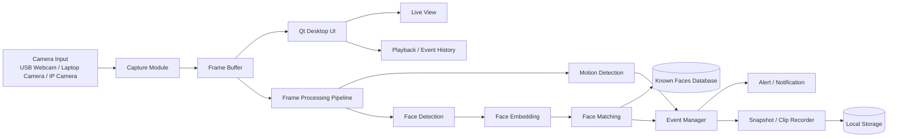

Architecture Diagram

## Implementation Plan

1. Build the Qt desktop shell with live view, pipeline status, known faces, and event history.
2. Add camera capture for USB webcam first, then extend to IP camera streams.
3. Keep the latest frame in a shared frame buffer for the UI and processing pipeline.
4. Add motion detection so the app only records or analyzes interesting frames.
5. Add face detection, then face embedding and matching against known faces.
6. Persist events, snapshots, and clips to local storage.
7. Add alert rules for motion or unknown faces.

## Current Progress

- Qt desktop dashboard is in place.
- USB webcam capture is wired through OpenCV and shown in the live view.
- The app currently opens camera index `0` when monitoring starts.
- Video-file capture is available through the Video Source controls and loops at the end of the file.
- Source settings are persisted with Qt `QSettings` under `capture/useVideoFile` and `capture/videoPath`.
