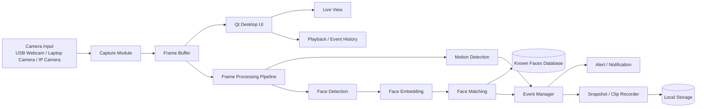

Architecture Diagram

```mermaid
flowchart LR
    CAM[Camera Input<br/>USB Webcam / Laptop Camera / IP Camera] --> CAPTURE[Capture Module]

    CAPTURE --> BUFFER[Frame Buffer]

    BUFFER --> UI[Qt Desktop UI]
    BUFFER --> PIPELINE[Frame Processing Pipeline]

    PIPELINE --> MOTION[Motion Detection]
    PIPELINE --> FACE_DETECT[Face Detection]
    FACE_DETECT --> FACE_EMBED[Face Embedding]
    FACE_EMBED --> MATCH[Face Matching]

    MATCH --> KNOWN[(Known Faces Database)]
    MATCH --> EVENT[Event Manager]

    MOTION --> EVENT

    EVENT --> ALERT[Alert / Notification]
    EVENT --> RECORD[Snapshot / Clip Recorder]

    RECORD --> STORAGE[(Local Storage)]

    UI --> LIVE_VIEW[Live View]
    UI --> PLAYBACK[Playback / Event History]
```
